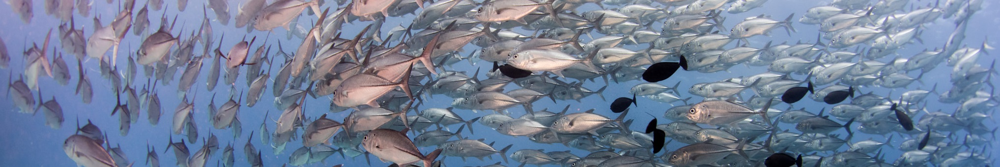
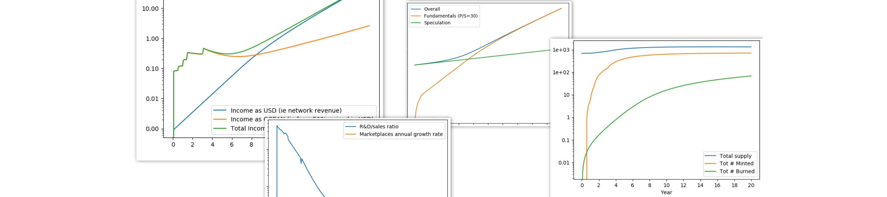
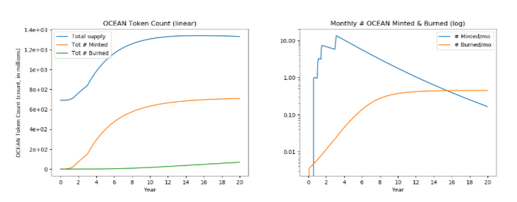

# TokenSPICE: EVM Agent-Based Token Simulator 🐟🌪️

TokenSPICE simulates tokenized ecosystems via an agent-based approach, with EVM in-the-loop.

It can help design, tune, and verify tokenized ecosystems. It's young but promising. We welcome you to contribute! 👋

- Each "agent" is a class. Has a wallet, and does work to earn $. One models the system by wiring up agents, and tracking metrics (kpis). Agents may be written in pure Python, or with an EVM-based backend.
- A "netlist" defines what you simulate, and how. It wires up a collection of agents to interact in a given way. You can write your own netlists to simulate whatever you like. The `assets/netlists` directory has examples.



Quick links:
- Discord: [te-tokenspice](https://discord.com/channels/701149241107808327/861621607825801216), [First time](https://discord.gg/FREcbdnUTw)
- Twitter: [@tokenspice](https://twitter.com/tokenspice)
- [Documentation](https://www.notion.so/TokenSPICE2-Docs-b6fc0b91269946eb9f7deaa020d81e9a)

History: TokenSPICE was [initially built to model](https://github.com/tokenspice/tokenspice0.1) the [Web3 Sustainability Loop](https://blog.oceanprotocol.com/the-web3-sustainability-loop-b2a4097a36e). It's now been generalized to support EVM, on arbitary netlists. Most initial work was by [trentmc](https://github.com/trentmc) ([Ocean Protocol](https://www.oceanprotocol.com)); more contributors have joined since.

# Contents

- [🏗 Initial Setup](#-initial-setup)
- [🏄 Do Simulations, Make Changes](#-do-simulations-make-changes)
- [🦑 Agents and Netlists](#-agents-and-netlists)
- [🐟 Updating Envt](#-updating-envt)
- [🐡 Backlog](#-backlog)
  - [Kanban Board](https://github.com/oceanprotocol/tokenspice/projects/1?add_cards_query=is%3Aopen)
- [🐋 Benefits of EVM Agent Simulation](#-benefits-of-evm-agent-simulation)
- [🦈 Resources](#-resources)
- [🏛 License](#-license)

# 🏗 Initial Setup

## Set up environment

Open a new terminal and:
```console
#ensure brownie's *not* installed. It causes problems
pip uninstall eth-brownie

#clone repo
git clone https://github.com/oceanprotocol/tokenspice.git tokenspice
cd tokenspice

#make sure we're not in env't; remove old env'ts
conda deactivate
conda remove --name tokenspiceenv --all

#create a python-anaconda env't in location ~/anaconda3/envs/tokenspiceenv
conda env create -f environment.yml

#activate env't
conda activate tokenspiceenv
```

## Get Ganache running

Open a new terminal and:
```console
cd tokenspice

#activate env't
conda activate tokenspiceenv

#run ganache
./ganache.py
```

Note: you could run ganache directly, but then you have to add many special arguments. The script above does that for you.

## Deploy the smart contracts to ganache

Open a separate terminal.


```console
#Grab the contracts code from main, *OR* (see below)
git clone https://github.com/oceanprotocol/contracts

#OR grab from a branch. Here's Alex's V4.1 prototype branch
git clone --branch feature/1mm-prototype_alex https://github.com/oceanprotocol/contracts
```

Then, deploy. In that same terminal:
```console
cd contracts

#one-time install
npm i

#compile .sol, deploy to ganache, update contracts/artifacts/*.json
npm run deploy
```

Finally, open `tokenspice/tokenspice.ini` and set `ARTIFACTS_PATH = contracts/artifacts`.
* Now, TokenSPICE knows where to find each contract on ganache (address.json file)
* And, it knows what each contract's interface is (*.json files).


## Test one EVM-based test

```console
conda activate tokenspiceenv
pytest web3engine/test/test_btoken.py 
```

## First usage of tsp

We use `tsp` for TokenSPICE in the command line.

First, add pwd to bash path.
```console
export PATH=$PATH:.
```

`tsp` is the command-line module. To see help, call it with no args.
```console
tsp
```

## Run simulation

Here's an example on a supplied netlist `simplegrant`.

Simulate the netlist, storing results to `outdir_csv`.
```console
tsp run assets/netlists/simplegrant/netlist.py outdir_csv
```

Output plots to `outdir_png`, and view them.
```console
tsp plot assets/netlists/simplegrant/netlist.py outdir_csv outdir_png
eog outdir_png
```

Here are example plots from [wsloop netlist](assets/netlists/wsloop/about.md). They track token count, tokens minted, tokens burned, and tokens granted over a 20 year period.



# 🏄 Do Simulations, Make Changes

## Do Once, At Session Start

**Start chain.** Open a new terminal and:
```console
cd ~/code/tokenspice
conda activate tokenspiceenv
./ganache.py
```

**Deploy contracts.** Open a new terminal and:
```console
cd ~/code/contracts
npm run deploy
```

## Do >=1 Times in a Session

**Update simulation code.** Open a new terminal. In it:
```console
cd ~/code/tokenspice
conda activate tokenspiceenv
./emacs <path/foo.py>
#then change foo.py in editor
```

**Run tests.** In the same terminal as before:
```console
#run a single pytest-based test
pytest tests/test_foo.py::test_foobar

#run a single pytest-based test file
pytest tests/test_foo.py

#run all tests in engine/ directory
pytest engine/

#run all tests except web3engine/ (slow)
pytest --ignore=web3engine

#run all tests
pytest

#run static type-checking. Dynamic is automatic.
mypy --config-file mypy.ini ./
```

## Test that everything is working

```console
conda activate tokenspiceenv
pytest
```

**Commit changes.**
```console
git add <changed filename>
git status -s [[check status]]
git commit -m <my commit message>
git push

#or

git status -s [[check status]]
git commit -am <my commit message>
git push
```

# 🦑 Agents and Netlists

## About Agents 

- Agents are defined at `assets/agents/`.
- All agents are written in Python
- Each Agent has an AgentWallet, which holds a Web3Wallet. The Web3Wallet holds a private key and creates TXs. 
- Some agents may wrap smart contracts deployed to EVM, e.g. `PoolAgent`.
- PoolAgent and many other EVM agents wrap Ocean or Balancer smart contracts, with Python driver middleware. A good Pythonic way to get familiar with the driver middleware is to play with [ocean.py](https://github.com/oceanprotocol/ocean.py). (Note that TokenSPICE currently copies-and-pastes some of that code, there is not a dependency.)

## About Netlists

The **netlist** defines what you simulate, and how.

Netlists are defined at `assets/netlists/`.

You can reuse existing ones or create your own. If you create your own, please add relevant unit tests.

For your own custom simulation, you can change any part of the netlist NETLISTX:
- `assets/netlists/NETLISTX/SimStrategy.py` which holds SimStrategy class - Simulation run parameters
- `assets/netlists/NETLISTX/KPIs.py` which holds KPIs class, `netlist_createLogData` function, and `netlist_plotInstructions` function - What metrics to log, and how to plot them
- `assets/netlists/NETLISTX/SimState.py` which holds SimState class - system-level structure & parameters - how agents instantiated and connected
- `assets/agents/*Agent.py` - Individual agent structure & parameters - each agent class. To change agent structure, you'll need to change its module (py or sol code). Unit tests are recommended.

Existing netlists include:

- [simplegrant](assets/netlists/simplegrant/about.md) - granter plus receiver, that's all. No EVM.
- [simplepool](assets/netlists/simplepool/about.md) - publisher that periodically creates new pools. EVM.
- [wsloop](assets/netlists/wsloop/about.md) - Web3 Sustainability Loop. No EVM.
- (WIP) [oceanv3](assets/netlists/oceanv3/about.md) - Ocean Market V3 - initial. EVM.
- (WIP) [oceanv4](assets/netlists/oceanv4/about.md) - Ocean Market V4 - safer staking. EVM.


# 🐟 Updating Envt

You don't need this info at the beginning, but it's good to know about as you make changes.

To change dependencies, first update `environment.yml`. Then:
```console
#make sure env't is active
conda activate tokenspiceenv

#main update. The 'prune' part gets rid of unused pkgs
conda env update --name tokenspiceenv --file environment.yml --prune
```

Leave environment:
```console
conda deactivate
```

Delete environment:
```console
conda remove --name tokenspiceenv --all
```


# 🐡 Backlog

**[Kanban Board](https://github.com/oceanprotocol/tokenspice/projects/1?add_cards_query=is%3Aopen)**

Some larger issues include:

- **Improve Continuous Integration** - various issues, see kanban 
- **Finish + verify Ocean V3 agents** #28. AKA: System identification: high-fidelity model of Ocean V3 (w/ Balancer V1); fit the model to observed on-chain dynamics
- **Finish + verify Ocean V4 agents** #29. AKA: Verification: high-fidelity model of Ocean V4 (w/ Balancer V2) base design, and the efficacy of each proposed mechanism.

In the longer term, we can expect:
- Improvements to TokenSPICE itself in the form of faster simulation speed, improved UX, and more.
- **[Higher-level tools](README-tools.md)** that use TokenSPICE, including design entry, verification, design space exploration, and more. 

# 🐋 Benefits of EVM Agent Simulation

TokenSPICE and other EVM agent simulators have these benefits:
- Faster and less error prone, because the model = the Solidity code. Don’t have to port any existing Solidity code into Python, just wrap it. Don’t have to write lower-fidelity equations.
- Enables rapid iterations of writing Solidity code -> simulating -> changing Solidity code -> simulating. 
- Super high fidelity simulations, since it uses the actual code itself. Enables modeling of design, random and worst-case variables.
- Mental model is general enough to extend to Vyper, LLL, and direct EVM bytecode. Can extend to non-EVM blockchain, and multi-chain scenarios. 
- Opportunity for real-time analysis / optimization / etc against *live chains*: grab the latest chain’s snapshot into ganache, run a local analysis / optimization etc for a few seconds or minutes, then do transaction(s) on the live chain. This can lead to trading systems, failure monitoring, more.

# 🦈 Resources

Here are further resources.

* Intro to SPICE & TokenSPICE [[Gslides - short](https://docs.google.com/presentation/d/167nbvrQyr6vdvTE6exC1zEA3LktrPzbR08Cg5S1sVDs)] [[Gslides - long](https://docs.google.com/presentation/d/1yUrU7AI702zpRZve6CCR830JSXrpPmfg00M5x9ndhvE)]
* TE for Ocean V3 [[Gslides](https://docs.google.com/presentation/d/1DmC6wfyl7ZMjuB-h3Zbfy--xFuYSt3tGACpgfJH9ZFk/edit)] [[video](https://www.youtube.com/watch?v=ztnIf9gCsNI&ab_channel=TokenEngineering)] , TE Community Workshop, Dec 9, 2020
* TE for Ocean V4.1 [[GSlides](https://docs.google.com/presentation/d/1JfFi9hT4Lf3UQKfCXGDhA27YPpPcWsXU7YArfRGAmMQ/edit#slide=id.p1)] [[slides](http://trent.st/content/20210521%20Ocean%20Market%20Balancer%20Simulations%20For%20TE%20Academy.pdf)] [[video](https://www.youtube.com/watch?v=TDG53PTbqhQ&ab_channel=TokenEngineering)] , TE Academy, May 21, 2021

Fishnado image sources (CC): [[1](https://www.flickr.com/photos/robinhughes/404457553)] [[2](https://commons.wikimedia.org/wiki/File:Fish_Tornado_(226274841).jpeg)]

# 🏛 License

Copyright ((C)) 2021 Ocean Protocol Foundation

Licensed under the Apache License, Version 2.0 (the "License");
you may not use this file except in compliance with the License.
You may obtain a copy of the License at

   http://www.apache.org/licenses/LICENSE-2.0

Unless required by applicable law or agreed to in writing, software
distributed under the License is distributed on an "AS IS" BASIS,
WITHOUT WARRANTIES OR CONDITIONS OF ANY KIND, either express or implied.
See the License for the specific language governing permissions and
limitations under the License.

