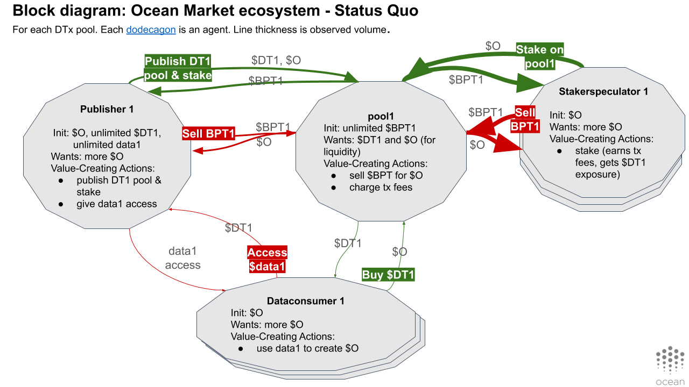
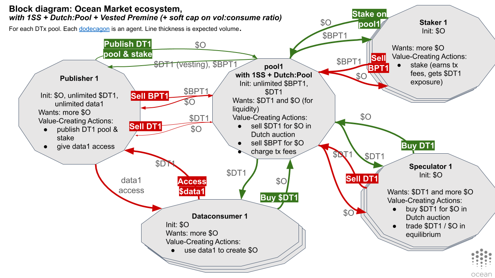

**WARNING: this is WIP code. Prototype, not fully functional, etc. Keep your expectations low. But maybe parts are useful to some:)**

# 🐠 TokenSPICE v0.2: Token Simulator with EVM

TokenSPICE can be used to help design, tune, and verify tokenized ecosystems in an overall Token Engineering (TE) flow.

TokenSPICE simulates tokenized ecosystems using an agent-based approach.

Each “agent” is a class. Has a wallet, and does work to earn $. One models the system by wiring up agents, and tracking metrics (kpis). Agents may be written in pure Python, or with an EVM-based backend. (The [original version](https://github.com/oceanprotocol/tokenspice) was pure Python. I may merge this repo into the original at some point.)

It's currently tuned to model [Ocean Market](https://market.oceanprotocol.com). The original version was tuned for the [Web3 Sustainability Loop](https://blog.oceanprotocol.com/the-web3-sustainability-loop-b2a4097a36e). However you can rewire the "netlist" of "agents" to simulate whatever you like. Simply fork it and get going.

TokenSPICE was meant to be simple. It definitely makes no claims on "best" for anything. Maybe you'll find it useful.

# Initial Setup

## Set up environment

Open a new terminal and:
```console
#ensure brownie's *not* installed. It causes problems
pip uninstall eth-brownie

#clone repo
git clone https://github.com/oceanprotocol/tokenspice2.git tokenspice
cd tokenspice

#make sure we're not in env't; remove old env'ts
conda deactivate
conda remove --name tokenspiceenv --all

#create a python-anaconda env't in location ~/anaconda3/envs/tokenspiceenv
conda env create -f environment.yml

#activate env't
conda activate tokenspiceenv
```

## Get Ganache running

Open a new terminal and:
```console
cd tokenspice

#active env't
conda activate tokenspiceenv

#run ganache
./ganache.py
```

Note: you could run ganache directly, but then you have to add many special arguments. The script above does that for you.

## Deploy the smart contracts to ganache

Open a separate terminal.


```console
#Grab the contracts code from main, *OR* (see below)
git clone https://github.com/oceanprotocol/contracts

#OR grab from a branch. Here's Alex's V4 prototype branch
git clone --branch feature/1mm-prototype_alex https://github.com/oceanprotocol/contracts
```

Then, deploy. In that same terminal:
```console
cd contracts

#one-time install
npm i

#compile .sol, deploy to ganache, update contracts/artifacts/*.json
npm run deploy
```

Finally, open `tokenspice/tokenspice.ini` and set `ARTIFACTS_PATH = contracts/artifacts`.
* Now, TokenSPICE knows where to find each contract on ganache (address.json file)
* And, it knows what each contract's interface is (*.json files).


## Test one EVM-based test

```console
conda activate tokenspiceenv
pytest web3engine/test/test_btoken.py 
```

## Test that everything is working

```console
conda activate tokenspiceenv
pytest
```

## Linting

Run linting, aka static type-checking by:

```console
mypy --config-file mypy.ini ./
```

Note: TokenSPICE also uses the `enforce_types` library for *dynamic* type-checking. 

# Updating Env't

You don't need this info at the beginning, but it's good to know about as you make changes.

To change dependencies, first update `environment.yml`. Then:
```console
#make sure env't is active
conda activate tokenspiceenv

#main update. The 'prune' part gets rid of unused pkgs
conda env update --name tokenspiceenv --file environment.yml --prune
```

Leave environment:
```console
conda deactivate
```

Delete environment:
```console
conda remove --name tokenspiceenv --all
```

# C. Do Simulations, Make Changes

## Do Once, At Session Start

**Start chain.** Open a new terminal and:
```console
cd ~/code/tokenspice
conda activate tokenspiceenv
./ganache.py
```

**Deploy contracts.** Open a new terminal and:
```console
cd ~/code/contracts
npm run deploy
```

## Do >=1 Times in a Session

**Update simulation code.** Open a new terminal. In it:
```console
cd ~/code/tokenspice
conda activate tokenspiceenv
./emacs <path/foo.py>
#then change foo.py in editor
```

**Run tests.** In the same terminal as before:
```console
#run a single pytest-based test
pytest tests/test_foo.py::test_foobar

#run a single pytest-based test file
pytest tests/test_foo.py

#run all tests in engine/ directory
pytest engine/

#run all tests except web3engine/ (slow)
pytest --ignore=web3engine

#run all tests 
pytest
```

**Commit changes.**
```console
git add <changed filename>
git status -s [[check status]]
git commit -m <my commit message>
git push

#or

git status -s [[check status]]
git commit -am <my commit message>
git push
```

**Change sim settings as needed.**
- To run faster: open `tokenspice.ini` and set `safety = False`. 

**Run simulation.** Here, we run a 10-day sim, storing to `outdir_csv`. Observe the results while running. See `help.py` for more options.
```console
rm -rf outdir_csv; ./run_1.py 10 outdir_csv 1>out.txt 2>&1 &
tail -f out.txt

Create plots from run results, and store them in `outdir_png`. Then view the images.
```console
rm -rf outdir_png; ./plot_1.py outdir_csv outdir_png
eog outdir_png
#finally, maybe import pngs into GSlides 
```

Then repeat previous steps as desired.

# TokenSPICE Design

# Architecture, Controllables, Uncontrollables, Metrics

### Top-level agent architecture

- All agents inherit BaseAgent
- Controllable agents use EVM.
- Uncontrollable agents use pure Python. But each has EOA.
   - Therefore the core dynamics are still on-chain

### AgentWallet connects Python agents to web3 behavior

- Each Agent has an AgentWallet.
- AgentWallet is the main bridge between higher-level Python and EVM.
- Each AgentWallet holds a Web3Wallet.
- The Web3Wallet holds a private key and creates TXs.

### Controllables

Controllable agents (structure): 
- What agents: just Pool (incl. Strategies and Pool Controllers).
- The agent's state is stored on blockchain. Deployment is not in the scope of TokenSPICE right now. TokenSPICE just sees ABIs.
- PoolAgent.py wraps BPool.sol. Agent's wallet grabs values from BPool.sol
   - current design (.sol) is at oceanprotocol/contracts
   - new design (.sol) is at branch 'feature/1mm-prototype_alex'
   - how can PoolAgent see it? draw on btoken.py etc.

Controllable variables:
- Global design vars. E.g. schedule for token distribution.
- Design vars within controllable agents
       
### Uncontrollables 

Uncontrollable Agents:
- Uncontrollable agents use pure Python. But each has an Externally Owned Address (EOA) to interact w EVM. Implemented inside Wallet.
- What agents: 
   - Status quo design: Publisher, Dataconsumer, Stakerspeculator
   - New design 1: Publisher, Dataconsumer, Staker, Speculator

Uncontrollable Variables (Env & rnd structure & params)
- Global rndvars & envvars. 
- Rndvars and envvars within controllable agents
- Rndvars and envvars within uncontrollable agents
- Ranges for envvars, and parameters for rndvar pdfs, are in constants.py, etc.


### Metrics
- These are what's output by SimEngine.py into the CSV, then plotted
- In the future, we could get fancier by leveraging TheGraph. 


## Changing Sim Parameters

The parameters are initially set with super-conservative values. Not reflective of reality. 

Here's where to change parameters:
- `engine/SimStrategy.py` - the whole file is parameters
- `util/constants.py` - same thing
- `engine/SimState.py` - where "magic number" is given 
- simulation time when invoking the run. E.g. run for 20 years or 150 years.

So, try playing with different parameter values and see what the results are. 

## Changing Sim Structures

TokenSPICE allows for change in the structure too. 

The file `engine/SimState.py` is the "netlist" that wires up "agents". Each agent "does its thing" on each time step. The main result is that the agent may update its wallet (holds USD and OCEAN), or another internal state variable of the agent.

Many Agents are defined in agents.py, and some in their own .py file. You can change an existing agent behavior, change the netlist, or create your agents and netlists. 

If you make changes here, it's a great idea to write unit tests to make sure your agent behaves how you expect. You'll find that TokenSPICE has more than a few unit tests:) That's not by accident, it helps us to feel confident in the simulation results.

Before making changes, we recommend having a better understanding of how the system works. Which brings us to...

## Schematics

Schematics to simulate Ocean Market. We've kept them in the context of system-level design (Web3 Sustainability Loop).

### Status quo model



### New model 1



[Gslides](https://docs.google.com/presentation/d/14BB50dkGXTcPjlbrZilQ3WYnFLDetgfMS1BKGuMX8Q0/edit#slide=id.p1)

# Backlog

Work is currently geared towards verifying Ocean V4, which updates Ocean smart contracts for better IDOs through one-sided market makers and more.

Here's progress on that front. (Last updated 2020-12-10).

**Done so far:**
- Wrote Ocean Market V4 smart contracts
- Drew schematics for V3 & V4
- Adapted TokenSPICE code
  - Run EVM end-to-end via ganache
  - Lets third-parties deploy to ganache, then uses at their ABIs
  - ABIs are wrapped as classes, which are inside agents.
  - Already include: Ocean datatokens, Ocean datatoken factory, Ocean friendly fork of Balancer AMM, Balancer AMM factory, etc. Have Unit tests for all.
  - Started writing Python-level agent behaviors

**Still to do:**
- Be able to specify a netlist and run, without having to fork [#30](https://github.com/oceanprotocol/tokenspice2/issues/30)
- Finish + verify Ocean V3 agents [#28](https://github.com/oceanprotocol/tokenspice2/issues/28)
- Finish + verify Ocean V4 agents [#29](https://github.com/oceanprotocol/tokenspice2/issues/29)
- And more. See [issues](https://github.com/oceanprotocol/tokenspice2/issues)


# A Final Word, or Two

1. Be careful not to read *too* much into any model. As George Box said, "all models are wrong, but some are useful."

2. Have fun!

# License

Copyright ((C)) 2021 Ocean Protocol Foundation

Licensed under the Apache License, Version 2.0 (the "License");
you may not use this file except in compliance with the License.
You may obtain a copy of the License at

   http://www.apache.org/licenses/LICENSE-2.0

Unless required by applicable law or agreed to in writing, software
distributed under the License is distributed on an "AS IS" BASIS,
WITHOUT WARRANTIES OR CONDITIONS OF ANY KIND, either express or implied.
See the License for the specific language governing permissions and
limitations under the License.

