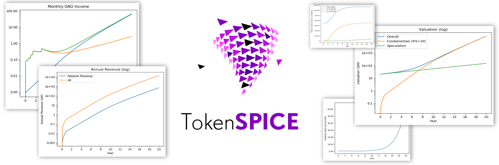
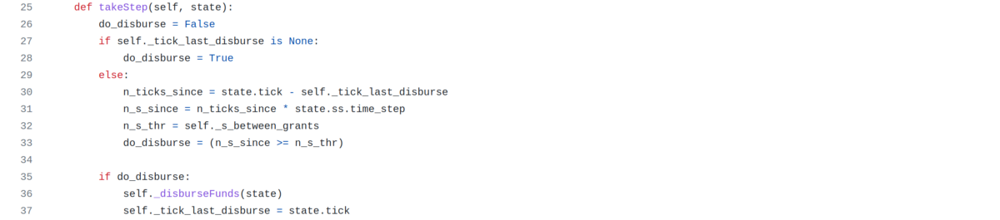

# TokenSPICE: EVM Agent-Based Token Simulator

<div align="center">

<!-- Pytest and MyPy Badges -->


<!-- Codacy Badges -->
[](https://www.codacy.com/gh/tokenspice/tokenspice/dashboard?utm_source=github.com&utm_medium=referral&utm_content=tokenspice/tokenspice&utm_campaign=Badge_Coverage)
[](https://www.codacy.com/gh/tokenspice/tokenspice/dashboard?utm_source=github.com&amp;utm_medium=referral&amp;utm_content=tokenspice/tokenspice&amp;utm_campaign=Badge_Grade)
  
</div>


TokenSPICE simulates tokenized ecosystems via an agent-based approach, with EVM in-the-loop.

It can help in [Token](https://blog.oceanprotocol.com/towards-a-practice-of-token-engineering-b02feeeff7ca) [Engineering](https://www.tokenengineering.org) flows, to design, tune, and verify tokenized ecosystems. It's young but promising. We welcome you to contribute! 👋

- TokenSPICE simulates by simply running a loop. At each iteration, each _agent_ in the _netlist_ takes a step. That's it! [Simple is good.](https://www.goodreads.com/quotes/7144975-i-apologize-for-such-a-long-letter---i-didn-t)
- A netlist wires up a collection of agents to interact in a given way. Each agent is a class. It has an Ethereum wallet, and does work to earn money. Agents may be written in pure Python, or with an EVM-based backend.
- One models a system by writing a netlist and tracking metrics (KPIs). One can write their own netlists and agents to simulate whatever they like. The [assets/netlists](https://github.com/tokenspice/tokenspice/tree/main/assets/netlists) directory has examples.

# Contents

- [👪 Community](#-community)
- [🏗 Initial Setup](#-initial-setup)
- [🏄 Do Simulations, Make Changes](#-do-simulations-make-changes)
- [🦑 Agents and Netlists](#-agents-and-netlists)
- [🐟 Updating Envt](#-updating-envt)
- [🐡 Backlog](#-backlog)
  - [Kanban Board](https://github.com/oceanprotocol/tokenspice/projects/1)
- [🐋 Benefits of EVM Agent Simulation](#-benefits-of-evm-agent-simulation)
- [🦈 Resources](#-resources)
- [🏛 License](#-license)

# 👪 Community

- Discord: [te-tokenspice](https://discord.com/channels/701149241107808327/861621607825801216), [first time](https://discord.gg/FREcbdnUTw). 
- TokenSPICE hacking sessions: Mondays at 17.00 Berlin // 11.00 Eastern // 8.00 Pacific. 120 min. [Zoom link](https://us02web.zoom.us/j/6985323627?pwd=YmxXaWNrdk1uSmV5bUFsaTJEWEtNZz09), Meeting ID 698 532 3627, Passcode 2021-99564. Anyone is welcome to drop in! 👋
- Twitter: [@tokenspice](https://twitter.com/tokenspice)
- Medium: [@tokenspice](https://medium.com/tokenspice)

History:
- TokenSPICE was [initially built to model](https://github.com/tokenspice/tokenspice0.1) the [Web3 Sustainability Loop](https://blog.oceanprotocol.com/the-web3-sustainability-loop-b2a4097a36e). It's now been generalized to support EVM, on arbitary netlists. 
- Most initial work was by [trentmc](https://github.com/trentmc) ([Ocean Protocol](https://www.oceanprotocol.com)); [several more contributors](https://github.com/tokenspice/tokenspice/graphs/contributors) have joined since 👪👨‍👩‍👧‍👧

# 🏗 Initial Setup

## Prerequisites

- Linux/MacOS
- Python 3.8.5+


## Set up environment

Open a new terminal and:
```console
#clone repo
git clone https://github.com/oceanprotocol/tokenspice.git
cd tokenspice

#create a virtual environment
python3 -m venv venv

#activate env
source venv/bin/activate

#install dependencies. Install wheel first to avoid errors.
pip install wheel
pip install -r requirements.txt
```

## Get Ganache running

Think of [Ganache](https://www.trufflesuite.com/docs/ganache/) as local EVM blockchain network, with just one node.

Open a new terminal and:
```console
#install Ganache (if you haven't yet)
npm install ganache-cli --global

#activate env't
cd tokenspice
source venv/bin/activate

#run ganache.py. It calls ganache cli and fills in many arguments for you.
./ganache.py
```

## Deploy the smart contracts to ganache

Below, you will deploy [smart contracts](https://github.com/oceanprotocol/contracts) from [Ocean Protocol](https://www.oceanprotocol.com). Those contracts include an ERC20 datatoken factory, ERC20 template, [Balancer](https://www.balancer.finance) pool factory, [Balancer pool template](https://github.com/balancer-labs/balancer-core/blob/master/contracts/BPool.sol), and metadata management. Each contract has a corresponding Python wrapper in the `web3engine` directory. Then, Python agents in `assets/agents` use these wrappers. 

You can add your own smart contracts by deploying them to EVM, then adding corresponding Python wrappers and agents to use them.

Let's do this. Open a new terminal and:
```console
#Grab the contracts code from main, *OR* (see below)
git clone https://github.com/oceanprotocol/contracts

#OR grab from a branch. Here's Alex's V4 prototype branch
git clone --branch feature/1mm-prototype_alex https://github.com/oceanprotocol/contracts

#here's the v4 contracts repo, enjoy:)
#https://github.com/oceanprotocol/contracts/tree/v4main
```

Then, deploy. In that same terminal:
```console
cd contracts

#one-time install
npm i

#compile .sol, deploy to ganache, update contracts/artifacts/*.json
npm run deploy
```

Finally, open `tokenspice/tokenspice.ini` and set `ARTIFACTS_PATH = contracts/artifacts`.
* Now, TokenSPICE knows where to find each contract on ganache (address.json file)
* And, it knows what each contract's interface is (*.json files).

## Test one EVM-based test

Open a new terminal and:
```console
#activate env't
source venv/bin/activate

#run test
pytest web3engine/test/test_btoken.py 
```

## First usage of tsp

We use `tsp` for TokenSPICE in the command line.

First, add pwd to bash path. In the terminal:
```console
export PATH=$PATH:.
```

To see help, call `tsp` with no args.
```console
tsp
```

## Run simulation

Here's an example on a supplied netlist `simplegrant`.

Simulate the netlist, storing results to `outdir_csv`.
```console
tsp run assets/netlists/simplegrant/netlist.py outdir_csv
```

Output plots to `outdir_png`, and view them.
```console
tsp plot assets/netlists/simplegrant/netlist.py outdir_csv outdir_png
eog outdir_png
```

Here are example plots from [wsloop netlist](assets/netlists/wsloop/about.md). They track token count, tokens minted, tokens burned, and tokens granted over a 20 year period.


# 🏄 Do Simulations, Make Changes

## Do Once, At Session Start

**Start chain.** Open a new terminal and:
```console
cd ~/code/tokenspice
source venv/bin/activate
./ganache.py
```

**Deploy contracts.** Open a new terminal and:
```console
cd ~/code/contracts
npm run deploy
```

## Do >=1 Times in a Session

**Update simulation code.** Open a new terminal. In it:
```console
cd ~/code/tokenspice
source venv/bin/activate

#then use editor to change assets/netlists/foo.py
```

**Run tests.** In the same terminal as before:
```console
#run a single pytest-based test
pytest web3engine/test/test_btoken.py::test_ERC20

#run a single pytest-based test file
pytest web3engine/test/test_btoken.py 

#run all tests in util/ directory
pytest util

#run all tests except web3engine/ (slow)
pytest --ignore=web3engine

#run all tests
pytest

#run static type-checking. Dynamic is automatic.
mypy --config-file mypy.ini ./
```

## Test that everything is working

```console
source venv/bin/activate
pytest
```

**Commit changes.**
```console
git add <changed filename>
git status -s [[check status]]
git commit -m <my commit message>
git push

#or

git status -s [[check status]]
git commit -am <my commit message>
git push
```

# 🦑 Agents and Netlists

## Agents Basics

Agents are defined at `assets/agents/`. Agents are in a separate directory than netlists, to facilitate reuse across many netlists.

All agents are written in Python. Some may include EVM behavior (more on this later).

Each Agent has an [`AgentWallet`](https://github.com/tokenspice/tokenspice/blob/main/engine/AgentWallet.py), which holds a [`Web3Wallet`](https://github.com/tokenspice/tokenspice/blob/main/web3tools/web3wallet.py). The `Web3Wallet` holds a private key and creates transactions (txs).

## Netlists Basics

The netlist defines what you simulate, and how.

Netlists are defined at `assets/netlists/`. You can reuse existing netlists or create your own.

## What A Netlist Definition Must Hold

TokenSPICE expects a netlist module (in a netlist.py file) that defines these specific classes and functions:

- `SimStrategy` class: simulation run parameters
- `KPIs` class and `netlist_createLogData()` function: what metrics to log during the run
- `netlist_plotInstructions()` function: how to plot the metrics after the run
- `SimState` class: system-level structure & parameters, i.e. how agents are instantiated and connected. It imports agents defined in `assets/agents/*Agent.py`. Some agents use EVM. You can add and edit Agents to suit your needs.

## How to Implement Netlists

There are two practical ways to specify `SimStrategy`, `KPIs`, and so on for netlist.py:

1. **For simple netlists.** Have just one file (`netlist.py`) to hold all the code for each class and method given above. This is appropriate for simple netlists, like [simplegrant](https://github.com/tokenspice/tokenspice/blob/main/assets/netlists/simplegrant/about.md) (just Python) and [simplepool](https://github.com/tokenspice/tokenspice/blob/main/assets/netlists/simplepool/about.md) (Python+EVM).

2. **For complex netlists.** Have one or more _separate files_ for each class and method given above, such as `assets/netlists/NETLISTX/SimStrategy.py`. Then, import them all into `netlist.py` file to unify their scope to a single module (`netlist`). This allows for arbitrary levels of netlist complexity. The [wsloop](https://github.com/tokenspice/tokenspice/blob/main/assets/netlists/wsloop/about.md) netlist is a good example. It models the [Web3 Sustainability Loop](https://blog.oceanprotocol.com/the-web3-sustainability-loop-b2a4097a36e), which is inspired by the Amazon flywheel and used by [Ocean](https://www.oceanprotocol.com), [Boson](https://www.bosonprotocol.io/) and others as their system-level token design.

## Agent.takeStep() method

The class `SimState` defines which agents are used. Some agents even spawn other agents. Each agent object is stored in the `SimState.agents` object, a dict with  some added querying abilities. Key `SimState` methods to access this object are `addAgent(agent)`, `getAgent(name:str)`, `allAgents()`, and `numAgents()`. [`SimStateBase`](https://github.com/tokenspice/tokenspice/blob/main/engine/SimStateBase.py) has details.

Every iteration of the engine make a call to each agent's `takeStep()` method. The implementation of [`GrantGivingAgent.takeStep()`](https://github.com/tokenspice/tokenspice/blob/main/assets/agents/GrantGivingAgent.py) is shown below. Lines 26–33 determine whether it should disburse funds on this tick. Lines 35–37 do the disbursal if appropriate.
There are no real constraints on how an agent's `takeStep()` is implemented. This which gives great TokenSPICE flexibility in agent-based simulation. For example, it can loop in EVM, like we show later.



## Netlist Examples
Here are some existing netlists.

- [simplegrant](assets/netlists/simplegrant/about.md) - granter plus receiver, that's all. No EVM.
- [simplepool](assets/netlists/simplepool/about.md) - publisher that periodically creates new pools. EVM.
- [wsloop](assets/netlists/wsloop/about.md) - Web3 Sustainability Loop. No EVM.
- (WIP) [oceanv3](assets/netlists/oceanv3/about.md) - Ocean Market V3 - initial design. EVM.
- (WIP) [oceanv4](assets/netlists/oceanv4/about.md) - Ocean Market V4 - solves rug pulls. EVM.

To learn more about how TokenSPICE netlists are structured, we refer you to the [simplegrant](assets/netlists/simplegrant/about.md) (pure Python) and [simplepool](assets/netlists/simplepool/about.md) (Python+EVM) netlists, which each have more thorough explainers. 

# 🐟 Updating Envt

You don't need this info at the beginning, but it's good to know about as you make changes.

First, ensure your env't is active.
```console
source venv/bin/activate
```

Install or uninstall packages using [pip](https://pip.pypa.io/en/stable/):
```console
#Install
pip install package-name

#Uninstall
pip uninstall package-name
```
Update requirements.txt:
```console
pip freeze > requirements.txt
```

# 🐡 Backlog

**[Kanban Board](https://github.com/oceanprotocol/tokenspice/projects/1?add_cards_query=is%3Aopen)**

Some larger issues include:

- **Finish + verify Ocean V3 agents** #28. AKA: System identification: high-fidelity model of Ocean V3 (w/ Balancer V1); fit the model to observed on-chain dynamics
- **Finish + verify Ocean V4 agents** #29. AKA: Verification: high-fidelity model of Ocean V4 (w/ Balancer V2) base design, and the efficacy of each proposed mechanism.

In the longer term, we can expect:
- Improvements to TokenSPICE itself in the form of faster simulation speed, improved UX, and more.
- **[Higher-level tools](README-tools.md)** that use TokenSPICE, including design entry, verification, design space exploration, and more. 

# 🐋 Benefits of EVM Agent Simulation

TokenSPICE and other EVM agent simulators have these benefits:
- Faster and less error prone, because the model = the Solidity code. Don’t have to port any existing Solidity code into Python, just wrap it. Don’t have to write lower-fidelity equations.
- Enables rapid iterations of writing Solidity code -> simulating -> changing Solidity code -> simulating. 
- Super high fidelity simulations, since it uses the actual code itself. Enables modeling of design, random and worst-case variables.
- Mental model is general enough to extend to Vyper, LLL, and direct EVM bytecode. Can extend to non-EVM blockchain, and multi-chain scenarios. 
- Opportunity for real-time analysis / optimization / etc against *live chains*: grab the latest chain’s snapshot into ganache, run a local analysis / optimization etc for a few seconds or minutes, then do transaction(s) on the live chain. This can lead to trading systems, failure monitoring, more.

# 🦈 Resources

Here are further resources.

* [TokenSPICE medium posts](https://medium.com/tokenspice), starting with ["Introducing TokenSPICE"](https://medium.com/tokenspice/introducing-tokenspice-fb4dac98bcf9) 
* Intro to SPICE & TokenSPICE [[Gslides - short](https://docs.google.com/presentation/d/167nbvrQyr6vdvTE6exC1zEA3LktrPzbR08Cg5S1sVDs)] [[Gslides - long](https://docs.google.com/presentation/d/1yUrU7AI702zpRZve6CCR830JSXrpPmfg00M5x9ndhvE)]
* TE for Ocean V3 [[Gslides](https://docs.google.com/presentation/d/1DmC6wfyl7ZMjuB-h3Zbfy--xFuYSt3tGACpgfJH9ZFk/edit)] [[video](https://www.youtube.com/watch?v=ztnIf9gCsNI&ab_channel=TokenEngineering)] , TE Community Workshop, Dec 9, 2020
* TE for Ocean V4 [[GSlides](https://docs.google.com/presentation/d/1JfFi9hT4Lf3UQKfCXGDhA27YPpPcWsXU7YArfRGAmMQ/edit#slide=id.p1)] [[slides](http://trent.st/content/20210521%20Ocean%20Market%20Balancer%20Simulations%20For%20TE%20Academy.pdf)] [[video](https://www.youtube.com/watch?v=TDG53PTbqhQ&ab_channel=TokenEngineering)] , TE Academy, May 21, 2021

Art:
- [TokenSPICE logos](https://github.com/tokenspice/art/blob/main/README.md)
- Fishnado image sources (CC): [[1](https://www.flickr.com/photos/robinhughes/404457553)] [[2](https://commons.wikimedia.org/wiki/File:Fish_Tornado_(226274841).jpeg)]

# 🏛 License

Copyright ((C)) 2021 Ocean Protocol Foundation

Licensed under the Apache License, Version 2.0 (the "License");
you may not use this file except in compliance with the License.
You may obtain a copy of the License at

   http://www.apache.org/licenses/LICENSE-2.0

Unless required by applicable law or agreed to in writing, software
distributed under the License is distributed on an "AS IS" BASIS,
WITHOUT WARRANTIES OR CONDITIONS OF ANY KIND, either express or implied.
See the License for the specific language governing permissions and
limitations under the License.


