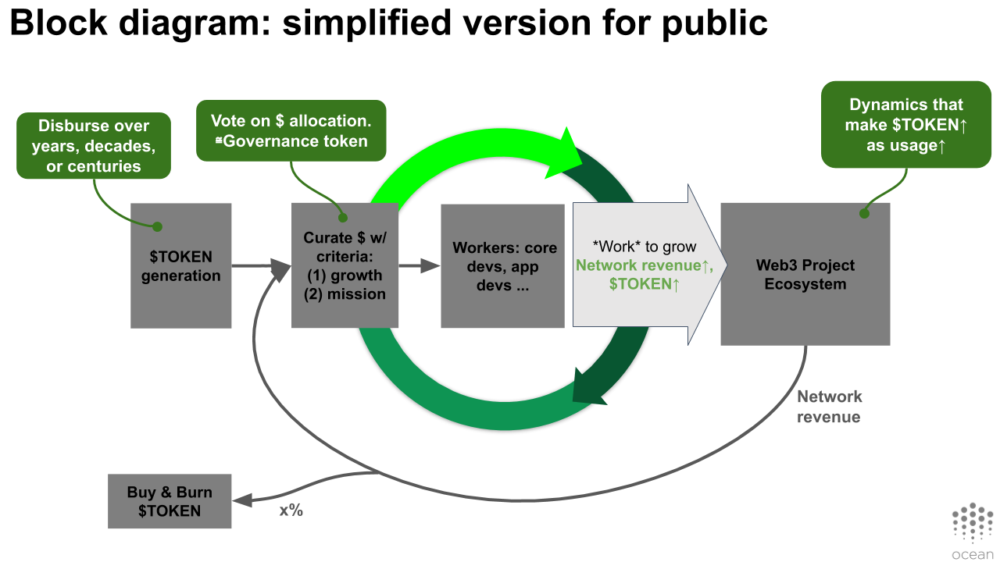
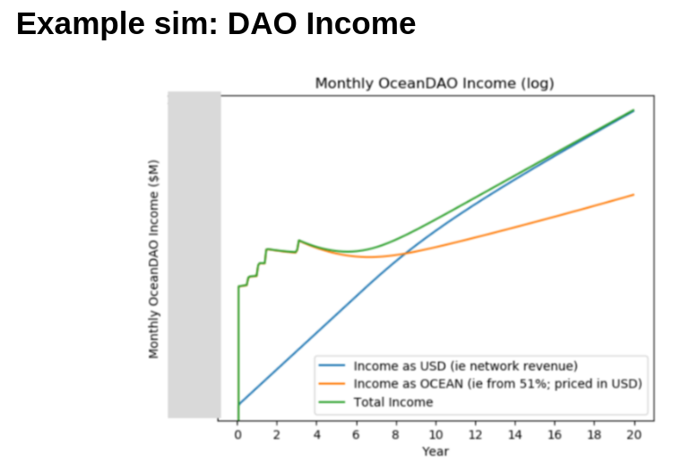

## About wsloop Netlist

### Overview

Wsloop = Web3 Sustainability Loop. It's a system-level token design to catalyze near-term growth and drive long-term sustainability, drawing on elements of revenue, burning, and work done in the ecosystem.

It first appeared as a blog post in 2020. [Here's the original article](https://blog.oceanprotocol.com/the-web3-sustainability-loop-b2a4097a36e). 

### Schematic / block diagram

Here's the block diagram as presented for broader public consumption. While it says Ocean, the system-level design is really quite general (Web3 Sustainability Loop).

That diagram glossed over some details. Here is a more accurate block diagram. 

### KPIs modeled

The plots show many key performance indicators (KPIs) and other variables changing over time. Here's how they affect each other.

We have slightly fancier models for growth rate and for token supply schedule. The details are [here](images/model-growth-rate.png) and [here](images/model-supply-schedule.png), respectively.

### Model scope and limitations

- This netlist does not attempt to model Ocean Market dynamics or the Balancer AMM at any level of fidelity, or staking in Ocean Market or elsewhere. See other netlists for this.

### Resources

Working Slides:
- [wsloop Key Variables Being Modeled](https://docs.google.com/presentation/d/1jsCg7iMcVM9Hk5wPeZyyN8WGXEzX2sDi98Yf0dH2F4Q/edit#slide=id.gfa42987b7d_0_73)

Other:
- "The Web3 Sustainability Loop" blog post [[ref](https://blog.oceanprotocol.com/the-web3-sustainability-loop-b2a4097a36e)] is a good first external reference
- Then, "Ocean Token Model" blog post [[ref](https://blog.oceanprotocol.com/ocean-token-model-3e4e7af210f9)] adds a bit more fidelity.
- The Ocean Whitepaper [[ref](https://oceanprotocol.com/tech-whitepaper.pdf)] has more fidelity yet.
- Then, see [Ocean System TE SW Verification](https://docs.google.com/presentation/d/1DmC6wfyl7ZMjuB-h3Zbfy--xFuYSt3tGACpgfJH9ZFk) section of "20201209 Ocean TE Study Group" slides, which goes into detail about TokenSPICE and results.  
- Finally, take a look at the netlist code here!

### Example plots

Running this netlist will give a plot for most of the variables modeled above, including market cap and token price.

Here are some example output plots.

