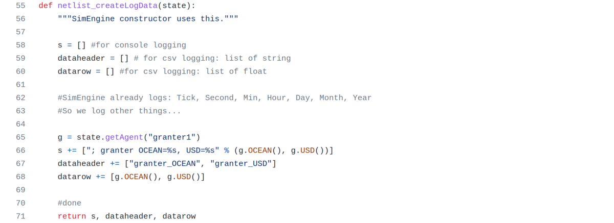
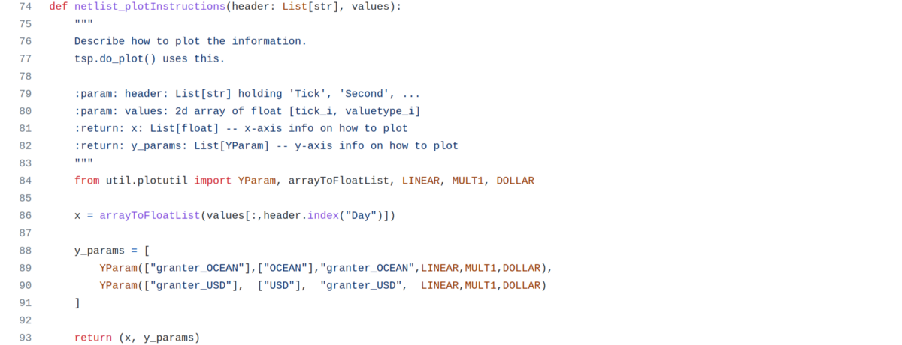

# simplegrant Netlist

## Overview

The [`simplegrant` netlist](netlist.py) at `netlists/simplegrant/netlist.py` has two agents (objects):

- `granter`, a [GrantGivingAgent](../../agents/GrantGivingAgent.py)
- `taker`, a [GrantTakingAgent](../../agents/GrantTakingAgent.py) 

As one might expect, `granter` gives grants to `taker` over time according to a simple schedule. This continues until runs out of money. These two agents are instantiated in the netlist's `SimStrategy` class.

[Here's the netlist code, in Python](netlist.py). It's just one file that defines `SimStrategy` class, `SimState` class, `KPIs` class, `netlist_createLogData()` function, and `netlist_plotInstructions()` function.

The following sections elaborate on each of these, sequentially top-to-bottom in the `netlist.py` file. They're worth understanding, because when you create your own netlist, you'll be making your own versions of these.

## Imports

Imports are at the top of the netlist.

Lines 1–2 import from third-party libraries: `enforce_types` for dynamic type-checking, and `List` and `Set` to specify types for type-checking.

Lines 4–6 import local modules: definitions for grant-giving and grant-taking agents from the agents directory; base classes for `KPIs`, `SimState` and `SimStrategy` (more on this later); and some constants.

## SimStrategy Class

The netlist defines the `SimStrategy` class by inheriting from a base class, then injecting code as needed. All magic numbers go here, versus scattering them throughout the code.

Lines 14–15 define values that every `SimStrategy` needs: a time interval between steps (set to one hour); and a stopping condition (set to 10 days).

Lines 18–20 define values specific to this netlist: how much OCEAN the granter starts with (1.0 OCEAN); the time interval between grants (3 days); and the number of grant actions (4 actions, therefore 1.0/4 = 0.25 OCEAN per grant).

## SimState Class

The netlist defines the `SimState` class by inheriting from a base class, then injecting code as needed.

Line 28 instantiates an object of class SimStrategy. We'd just defined that class earlier in the netlist.

Lines 32–37 instantiates the granter object. It's a `GrantGivingAgent` which is defined in `agents`. Like all agent instances, it's given a name ("granter1"), initial USD funds (0.0) and initial OCEAN funds (specified via `SimStrategy`). As a `GrantGivingAgent`, it needs a few more parameters: the name of the agent receiving funds ("taker1"), the time interval between grants (via `SimStrategy`), and number of actions (via `SimStrategy`). Note how magic numbers are kept out of here; they stay in SimStrategy.

Lines 38–39 instantiates the `taker` object. It's a `GrantTakingAgent`. It's given a name ("taker1"); see how this is the same name that the `granter` has specified where funds go. This is how the netlist gets "wired up", similar in philosophy to [SPICE](https://medium.com/tokenspice/tokenspice-design-verification-flows-5b795c594f9c). Finally, the `taker`'s initial funds are specified, as 0.0 USD and 0.0 OCEAN.

## KPIs Class

The netlist defines the `KPIs` by inheriting from a base class, then injecting code as needed. The base class already tracks many metrics out-of-the-box including each agent's OCEAN balance at each time step. This netlist doesn't need more, so its `KPIs` class is simply a pass-through.

## netlist_createLogData

The netlist defines the `netlist_createLogData()` function, which is called by the core simulator engine `SimEngine` in each `takeStep()` iteration of a simulation run.

Lines 58–60 initializes these 3 variables: `s`, `dataheader`, and `datarow`. The rest of the routine fills them in, iteratively.

- Line 65 grabs the "granter1" agent from the `SimState` object `state`. The lines below will use that agent. This function can to grab any data from SimState. Since SimState holds all the agents, this function can grab any any agent. The lines that follow query information from the "granter" agent `g`.
- `s` is a list of strings to be logged to the console's standard output (stdout), where the final string is a concatenation of all items in the list. Line 66 updates `s` with another item, for the `granter`'s  OCEAN balance and USD balance. Those values are retrieved by querying the `g` object.
- The other two variables are towards constructing a csv file, where the first row has all the header variable names and each remaining row is another datapoint corresponding to a time step.
- This function constructs `dataheader` as the list of header names. Line 67 adds the "granter_OCEAN" and "granter_USD" variables to that list.
- This function constructs `datarow` as a list of variable values, i.e. a datapoint. Each of these has 1:1 mapping to header names added to `dataheader`. This function queries the the `g` object to fill in the values.

While this netlist (`simplegrant`) only records a single group of values (OCEAN and USD balance), other netlists like `wsloop` record several  groups of values.

## netlist_plotInstructions

The netlist defines the `SimState` by inheriting from a base class, then injecting code as needed.

This concludes the description of the `simplegrant` netlist. If you're working on learning the structure of TokenSPICE netlists, a great next step is the description of `simplepool` netlist, [here](../simplepool/about.md).

